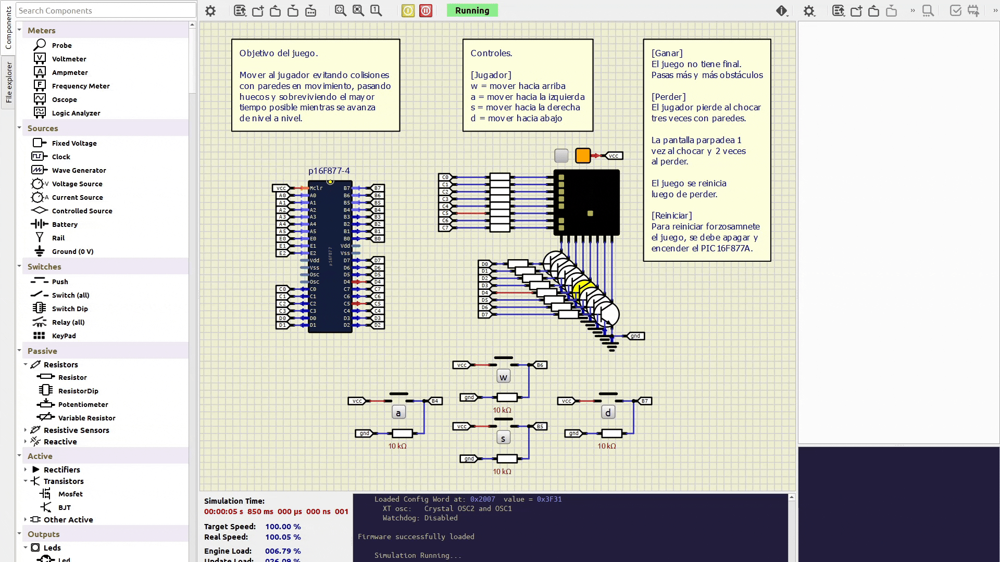

# PIC16F877A – Juego en Assembly



> Proyecto desarrollado durante el cuarto semestre de la carrera de Ingeniería en Electrónica y Sistemas Inteligentes (INACAP).

## Descripción
Juego desarrollado completamente en Assembly para el microcontrolador PIC16F877A.
El proyecto implementa lógica de juego en tiempo real, generación pseudoaleatoria de obstáculos, detección de colisiones, sistema de niveles y control por interrupciones.

El renderizado se realiza sobre una matriz LED 8×8, controlada directamente desde los puertos del microcontrolador.

## Características
- Control del jugador mediante **interrupciones por cambio en PORTB**
- Obstáculos verticales y horizontales
- Generación pseudoaleatoria de huecos en paredes
- Sistema de vidas (3)
- Aumento progresivo de dificultad por nivel
- Renderizado directo mediante **PORTC (filas)** y **PORTD (columnas)**

## Controles
| Pin PORTB | Acción |
|----------|--------|
| RB4 | Mover izquierda |
| RB5 | Mover abajo |
| RB6 | Mover arriba |
| RB7 | Mover derecha |

## Tecnologías
- **Microcontrolador:** PIC16F877A  
- **Lenguaje:** Assembly (MPASM)  
- **Entorno:** MPLAB / Simulación o hardware real  

## Estructura
```
/
├── main.asm # Código fuente completo del juego
├── simulide/
│ └── WallDash.sim1
```

## Contexto académico
Este proyecto fue desarrollado como parte de la **Evaluación Sumativa 1** de la asignatura **Sistemas Electrónicos Programables (IMSP01)**.

El objetivo de la evaluación fue diseñar y programar, en lenguaje ensamblador, un sistema interactivo basado en un microcontrolador PIC y una matriz LED 8×8, incorporando:

- Manejo de entradas digitales mediante pulsadores
- Lógica de control y animación en bajo nivel
- Uso de interrupciones
- Estructuración del código en subrutinas
- Documentación clara del funcionamiento del sistema

## Simulación (SimulIDE)
El proyecto incluye un archivo de simulación para SimulIDE que permite
visualizar y probar el juego en un entorno virtual con el PIC16F877A.

Ruta: simulide/WallDash.sim1

Requisitos:
- SimulIDE (https://simulide.com)

Abrir el archivo `.sim1` directamente desde SimulIDE. Dentro de esta simulación, abrir el archivo `.hex` para el mcu.

## Licencia
MIT License
